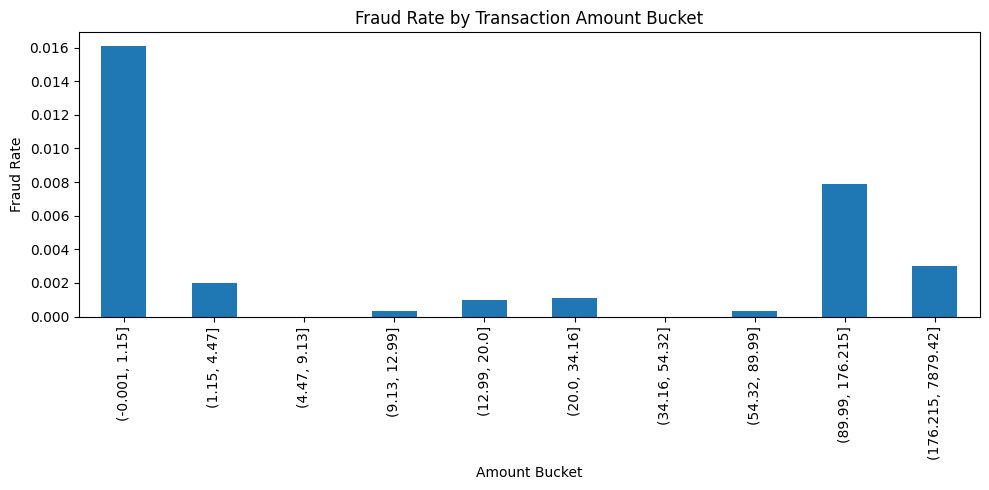
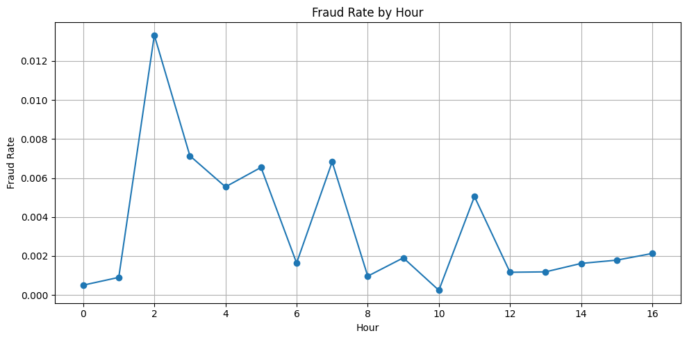

## Project Overview

This project analyzes a public credit-card transaction dataset (284k transactions) to identify behavioral patterns associated with fraudulent activity.

The goal is to explore transaction behavior and highlight potential operational monitoring rules for fraud detection.

# Fraud Operations Analytics

Tools used:
- Python (pandas)
- SQL
- Jupyter / Google Colab
- GitHub

The analysis focuses on:
- fraud frequency by transaction size
- fraud activity over time
- rapid repeated transactions

## Dataset

The dataset used in this project is publicly available on Kaggle:

Credit Card Fraud Detection Dataset  
https://www.kaggle.com/datasets/mlg-ulb/creditcardfraud

Download the file **creditcard.csv** and place it in the following local folder before running the notebook:

data/creditcard.csv

Note: The dataset is large (143MB), so it is not stored directly in this GitHub repository.

## Project structure

fraud-ops-analytics
│
├── notebooks
│   fraud_ops.ipynb
│
├── images
│   fraud_rate_by_amount.png
│   fraud_rate_by_hour.png
│
├── sql
│   fraud_ops.sql
│
└── README.md

notebooks/ – full Python analysis
images/ – visualization outputs used in the project
sql/ – SQL examples reproducing similar analyses

## Fraud Patterns

## Fraud rate by transaction amount



Analysis of transaction amounts shows that fraud transactions are more common among smaller transaction values.
This suggests fraudsters may attempt to avoid detection by performing many small purchases instead of large ones.

## Fraud activity by hour



We analyzed fraud frequency across hourly buckets derived from the transaction timestamp (Time).

**Method**
- Converted the dataset’s `Time` (seconds since first transaction) into hourly buckets.
- Computed fraud rate per hour using pandas `groupby`.

**Observation**
- Fraud rate spikes around hour **2**, reaching ~**1.3%**, while most hours remain near **0.1–0.2%**.

**Interpretation**
- Fraud attempts may cluster during low-activity periods (e.g., late-night hours) when monitoring or user activity is lower.

**Operational implication**
- Fraud detection systems may benefit from increased monitoring or stricter alert thresholds during these periods.

  **Core logic (Python / pandas)**

```python
df['hour'] = (df['Time'] // 3600) % 24

fraud_by_hour = (
    df.groupby('hour')['Class']
      .agg(['count','sum','mean'])
      .rename(columns={
          'count':'transactions',
          'sum':'frauds',
          'mean':'fraud_rate'
      })
)

## Rapid repeated transactions

Fraudulent activity can occur as bursts of transactions within very short time intervals.

Attackers may attempt multiple charges quickly to test stolen cards or exploit automated payment systems.

Method:
- Sort transactions by timestamp
- Compute the previous transaction time
- Calculate the time gap between events

Insight:
Transactions occurring within very short intervals may indicate automated fraud attempts or card testing behavior.

Operational implication:
Monitoring systems may benefit from additional alerts for clusters of transactions occurring within seconds of each other.

## Key findings

1. **Fraud by transaction amount**  
   Fraud activity is more common in smaller transactions.

2. **Fraud by time of activity**  
   Fraud spikes during early hours of the transaction timeline.

3. **Rapid repeated transactions**  
   Fraud events can occur in short bursts of activity.

These patterns suggest that fraud detection systems should monitor:
- clusters of small transactions
- unusual activity during low-traffic hours
- rapid repeated transaction attempts

## D4 — Rapid Transaction Bursts

I analyzed the time gap between consecutive transactions using the dataset's `Time` feature (seconds since the first transaction).

Transactions were grouped into:
- under 1 second
- 1 to 10 seconds
- 10 to 60 seconds

### Key Finding

The highest fraud rate was observed in the **1–10 second** bucket (~0.70%), followed by the 10–60 second bucket (~0.59%).

Interestingly, transactions occurring in under 1 second had a lower fraud rate (~0.22%), suggesting that fraud is not associated with the fastest possible activity, but rather with short bursts within a few seconds.

The 1–10 second bucket also contained over 5,000 transactions, making this pattern both statistically meaningful and operationally relevant.

### Visualization


